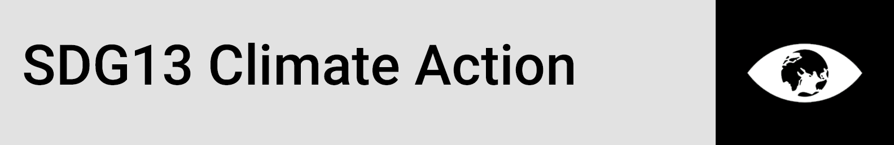
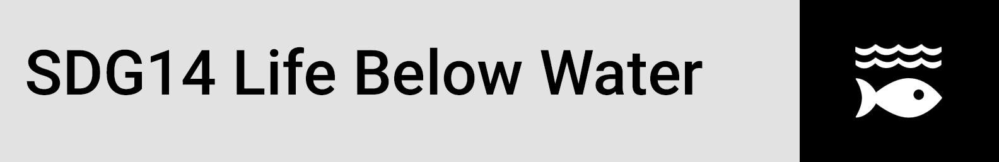
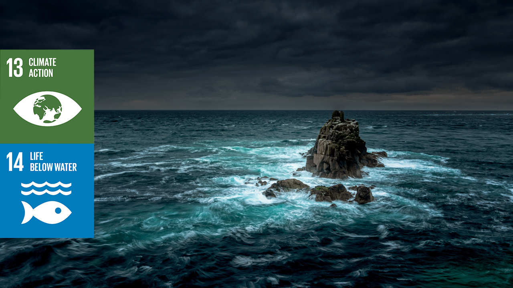
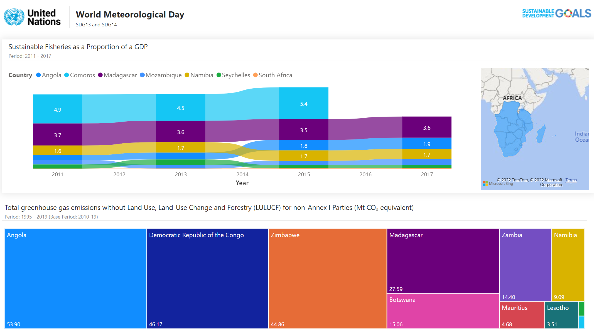

<h1 align="center">United Nations World Meteorological Day, 23 March 2022</a></h1>


<p align='center'>




</p>


## Overview
<p>

<!--<em>An adolescent girl conducts an experiment during a chemistry class in Kamulanga Secondary School in Lusaka, Zambia,  Photo:UNICEF Photo/UN0145554/Karin Schermbrucker </em>-->
</p>
The World Meteorological Day theme - The ocean, our climate and weather – celebrates WMO’s focus in connecting the ocean, climate and weather  within the Earth System. It also  marks the starting year of the United  Nations Decade of Ocean Science for Sustainable Development (2021-2030). The Decade galvanizes efforts to gather ocean science – through  innovative and transformative ideas - as the basis of information to  support sustainable development.  WMO, as the United Nations specialized agency for climate, weather and water, strives to support understanding the inextricable link between ocean, climate and weather. This helps us understand the world in which we live, including the impacts of climate change, and to help Members to strengthen their ability to keep lives  and property safe – reducing the risk of disaster – and to maintain  viable economies. [^World Meteorological Organization]


## Solution Design: Architecture and Data Points Identification

**API Documentation**: https://unstats.un.org/SDGAPI/swagger/# 

**UNSDG Goal Codes**

Returns the list of all Goals currently published in the latest release, you can include all the Targets, Indicator and series description using `includechildren`

```
curl -X GET --header 'Accept: application/json' 'https://unstats.un.org/SDGAPI/v1/sdg/Goal/List?includechildren=true'
```

https://unstats.un.org/SDGAPI/v1/sdg/Goal/List?includechildren=true

**1. United Nations Statistics Division SDG API**

The metadata available in this repository is a work in progress. It  reflects the latest reference metadata information provided by the UN  System and other international organizations on data and statistics for  the Tier I and II indicators in the global indicator framework. This  repository will be further updated and periodically reviewed in  cooperation with the respective data compilers.

**Metadata Repository: **https://unstats.un.org/sdgs/metadata/, used to identify the relevant data points in relation to the theme of this analysis report. Then for verification of inclusive data points from most member states the availability is checked on this link https://unstats.un.org/sdgs/dataportal/analytics/DataAvailability

**Using the API**

The API loads the data in pages, to pull all data from the pages an iterator function is built in PowerBI to invoke when adding columns to an index table with the matching number of pages.

````java
(page as text) as table =>
let
    indicator = Text.Proper("indicator=13.2.1&indicator=13.2.2&indicator=14.4.1&indicator=14.7.1"),
    country = Text.Proper("areaCode=174&areaCode=180&areaCode=24&areaCode=426&areaCode=450&areaCode=454&areaCode=480&areaCode=508&areaCode=516&areaCode=690&areaCode=710&areaCode=716&areaCode=72&areaCode=748&areaCode=834&areaCode=894"),

    Source = Json.Document(Web.Contents("https://unstats.un.org/SDGAPI/v1/sdg/Indicator",    
    [RelativePath = "Data?"&(indicator)&"&"&(country)&"&page="&(page)])),
````

**Data Minimisation (GDPR)**

Returns a list of geographies that have values on that Goal - https://unstats.un.org/SDGAPI/v1/sdg/Goal/13/GeoAreas, where 13 is the goal code, codes represent the SDG number, relevant codes for this analysis are SDG13 and SDG14. This will showcase which member countries of SADC have data on both of the codes

**URL:** https://unstats.un.org/SDGAPI/v1/sdg/Indicator/Data?indicator=13.2.1&indicator=13.2.2&indicator=14.4.1&indicator=14.7.1&areaCode=174&areaCode=180&areaCode=24&areaCode=426&areaCode=450&areaCode=454&areaCode=480&areaCode=508&areaCode=516&areaCode=690&areaCode=710&areaCode=716&areaCode=72&areaCode=748&areaCode=834&areaCode=894&page=1

- **areaCode:** SADC member country code, see Metadata repository

- **indicator: ** selected indicator codes based on theme, *13.2.1, 13.2.2, 14.4.1 and 14.7.1*

  

**2. SADC Member States API**

> **Server** - https://www.uvicorn.org/
> **API** - https://fastapi.tiangolo.com/
> **Heroku** - https://heroku.com/

**Current State: **[Sample work started to be continued in the next publication]

- Github repository with the API code: https://github.com/lmakoti/fa-sample-python

- API doc page: https://fa-sample-python.herokuapp.com/docs

  

## Data Points Definitions

#### **Goal 13. Take urgent action to combat climate change and its impacts[b]**.

- **Target 13.2:** Integrate climate change measures into national policies, strategies and planning

  - **Indicator 13.2.1**: Number of countries with nationally determined contributions, long-term strategies, national adaptation plans and adaptation communications, as reported to the secretariat of the United Nations Framework Convention on Climate Change 

  - **Indicator 13.2.2**: Total greenhouse gas emissions per year 

#### Goal 14. Conserve and sustainably use the oceans, seas and marine resources for sustainable development

- **Target 14.4**: By 2020, effectively regulate harvesting and end overfishing, illegal, unreported and unregulated fishing and destructive fishing practices and implement science-based management plans, in order to restore fish stocks in the shortest time feasible, at least to levels that can produce maximum sustainable yield as determined by their biological characteristics
  - **Indicator 14.4.1**: Proportion of fish stocks within biologically sustainable levels 

- **Target 14.7**: By 2030, increase the economic benefits to small island developing States and least developed countries from the sustainable use of marine resources, including through sustainable management of fisheries, aquaculture and tourism
  - **Indicator 14.7.1**: Sustainable fisheries as a proportion of GDP in small island developing States, least developed countries and all countries 


## Dashboard

**Dashboard Download (PDF, PBIX)**: <a href="World Meteorological Day (WMO-EC-XII-Res6).pdf">PDF Download</a> , <a href="World Meteorological Day (WMO-EC-XII-Res6).pbix">PowerBI Download (PBIX)</a>

1. **Page 01**




## Networking

Connecting and building networks is always part of our priorities, please reach out if you have any ideas on collaborative efforts or any suggestions on ways we could improve our work: 


## License

This license lets others distribute, remix, adapt, and build upon your  work, even commercially, as long as they credit you for the original  creation. This is the most accommodating of licenses offered.  Recommended for maximum dissemination and use of licensed materials. (https://creativecommons.org/licenses/)


____

## **References**

[^World Meteorological Organization]: https://public.wmo.int/en/resources/world-meteorological-day/wmd-2021-the-ocean-our-climate-and-weather


